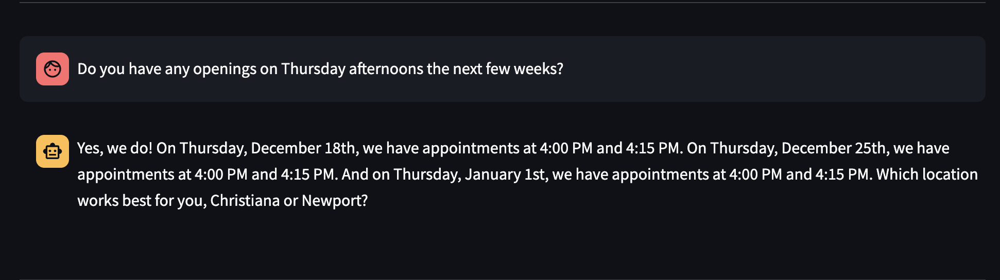
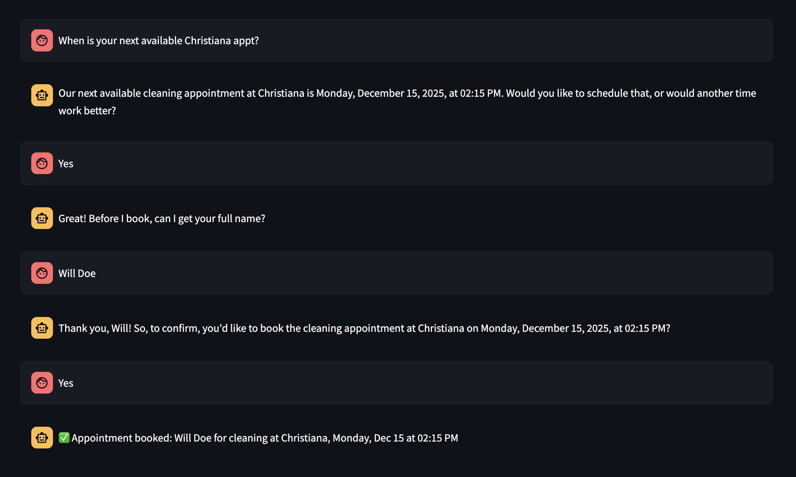
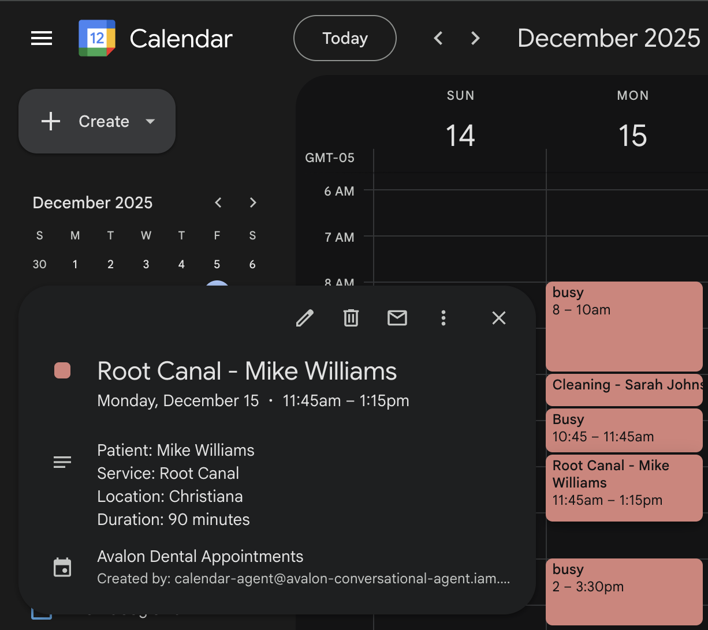
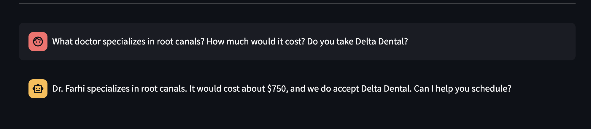
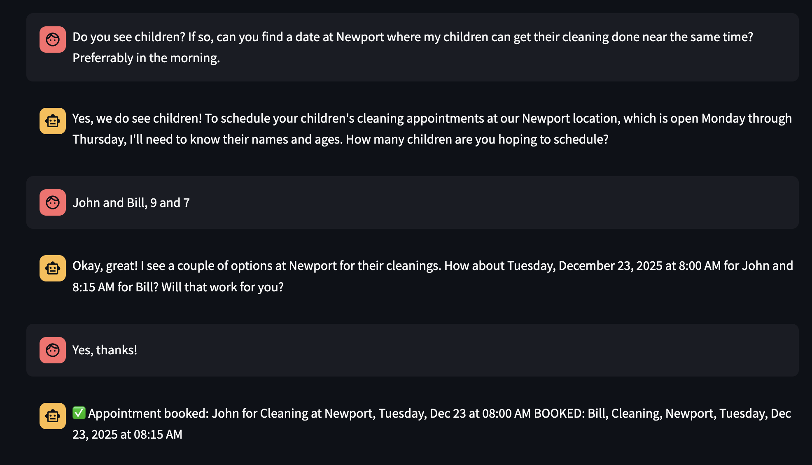

# Dental Conversational/Scheduling Agent

**[Live Demo](https://avalon-agent-50611883012.us-central1.run.app/)** | RAG-powered scheduling assistant with real-time calendar integration

---

## Try the Demo

The live demo is fully functional—you can actually book appointments and watch them appear on the calendar in real-time.

**Try these:**
- "I need to schedule a root canal this Wednesday morning at Christiana"
- "What's available for a cleaning this Tuesday at Newport?"
- "How much does a crown cost?"
- "What does Dr. Farhi specialize in?"
- "Do you accept Delta Dental insurance?"



The agent handles the full scheduling flow: checking availability, collecting patient info, confirming details, and booking to the calendar.



---

## The Problem

Dental practices lose significant revenue and staff time on manual appointment scheduling:
- **Phone tag** → staff spend 20+ minutes per patient playing voicemail back-and-forth
- **After-hours inquiries** → 40% of scheduling requests come outside business hours
- **No-shows** → without automated reminders, practices see 15-20% no-show rates
- **Staff burnout** → front desk handles 50+ calls daily instead of focusing on in-office patients

## The Solution

Built a conversational AI agent that handles patient scheduling via text message, available 24/7. Uses RAG (Retrieval-Augmented Generation) for accurate office information and integrates directly with Google Calendar for real-time availability. The production version at Avalon Dental uses a LoRA fine-tuned Mistral-7B model trained on 500+ real patient conversations.

---

## Demo vs Production

This portfolio demo showcases the full architecture and is fully functional. The production system at Avalon Dental has additional enterprise features:

| Feature | Demo (Portfolio) | Production (Avalon Dental) |
|---------|------------------|---------------------------|
| **LLM** | Gemini 2.0 Flash API | LoRA fine-tuned Mistral-7B |
| **Training Data** | 70 synthetic conversations | 500+ real patient conversations |
| **Calendar** | Single demo calendar | Separate calendars per location |
| **Booking** | Direct to Google Calendar | Syncs with practice management software (Dentrix) |
| **Patient Data** | Public view (free/busy) | Full HIPAA-compliant patient records |
| **Deployment** | Cloud Run | Dedicated GPU instance |

**Note:** In production, a background script syncs Google Calendar with the practice management software to ensure real appointment data flows bidirectionally.

### Real Booking Example

When you book through the demo, appointments appear on the calendar with patient name, service type, location, and correct duration:



---

## Key Features

### 1. RAG-Powered Knowledge Base (40+ Chunks)

The agent retrieves accurate information about:
- Office locations, hours, and contact info
- Provider bios and specializations  
- Service descriptions, durations, and pricing
- Insurance acceptance and payment options
- Policies (cancellation, new patients, emergencies)



### 2. Duration-Aware Scheduling

The system understands procedure durations and only offers valid slots:

| Procedure | Duration |
|-----------|----------|
| Extraction/Emergency | 30 minutes |
| Cleaning/Filling | 45 minutes |
| Whitening/New Patient Exam | 60 minutes |
| Crown/Root Canal/Implant | 90 minutes |

If there's a 45-minute gap between appointments, a cleaning fits but a root canal doesn't. The agent automatically filters availability based on the requested service.

### 3. Real-Time Calendar Integration

- Checks live availability from Google Calendar API
- Books appointments that appear immediately on the calendar
- Prevents double-booking with conflict detection
- Supports multiple locations with different hours
- Books up to 3 weeks in advance

### 4. Multi-Location Support

Two locations with different hours:
- **Christiana:** Mon-Thu 7:30 AM - 6:30 PM
- **Newport:** Mon-Thu 8:00 AM - 5:00 PM

The agent knows which location the patient wants and only shows availability for that location.



---

## Architecture
```
                    CONVERSATION FLOW
        +---------------------------+
        |      Patient Message      |
        |   "Schedule a cleaning"   |
        +-----------+---------------+
                    |
                    v
        +---------------------------+
        |     RAG Retrieval         |
        |  ChromaDB + Embeddings    |
        |  → Office info, services  |
        +-----------+---------------+
                    |
                    v
        +---------------------------+
        |   Calendar API Check      |
        |  Get available slots      |
        |  Filter by duration       |
        +-----------+---------------+
                    |
                    v
        +---------------------------+
        |      LLM Generation       |
        |  Gemini 2.0 Flash (Demo)  |
        |  Mistral-7B LoRA (Prod)   |
        +-----------+---------------+
                    |
                    v
        +---------------------------+
        |    Response + Booking     |
        |  Parse confirmation       |
        |  Create calendar event    |
        +-----------+---------------+
                    |
                    v
        +---------------------------+
        |    Google Calendar API    |
        |  Real-time availability   |
        |  Appointment creation     |
        +---------------------------+
```

---

## LoRA Fine-Tuning (Production)

The production model uses LoRA (Low-Rank Adaptation) fine-tuning on Mistral-7B to learn:
- Avalon Dental's specific tone and communication style
- Common patient questions and appropriate responses
- Scheduling workflow and confirmation patterns
- Policy enforcement (cancellation notice, insurance questions)

**Training Details:**
- Base model: Mistral-7B-Instruct-v0.2
- Method: LoRA with PEFT (r=16, alpha=32)
- Training data: 70 synthetic conversations (demo), 500+ real conversations (production)
- Format: Multi-turn patient-assistant dialogues

The notebook `03-lora-finetuning.ipynb` demonstrates the methodology. The adapter shown is a proof-of-concept with limited training—production uses significantly more compute and data.

**Why LoRA over full fine-tuning?**
- 10x lower memory requirements
- Can run on single GPU (A100 40GB)
- Preserves base model capabilities
- Easy to swap adapters for different practices

---

## Tech Stack

| Category | Technologies |
|----------|-------------|
| **ML Platform** | Vertex AI Workbench, Google Colab |
| **LLM** | Gemini 2.0 Flash API (demo), Mistral-7B + LoRA (production) |
| **RAG** | ChromaDB, Sentence Transformers |
| **Calendar** | Google Calendar API |
| **Deployment** | Cloud Run, Docker |
| **Fine-tuning** | PEFT, LoRA, Hugging Face Transformers |
| **Frontend** | Streamlit |

---

## Project Structure
```
dental-conversational-agent/
├── README.md
├── .gitignore
├── notebooks/
│   ├── 01-data-preparation.ipynb      # Create RAG knowledge base
│   ├── 02-rag-setup.ipynb             # ChromaDB + embeddings
│   ├── 03-lora-finetuning.ipynb       # LoRA training on Mistral-7B
│   ├── 04-calendar-integration.ipynb  # Google Calendar API
│   └── 05-agent-integration.ipynb     # Full agent pipeline
├── screenshots/
│   ├── cal.png                        # Calendar booking example
│   ├── convo-1.png                    # Demo conversation
│   ├── convo-2.png
│   ├── convo-3.png
│   ├── convo-4.png
│   └── convo-5.png
└── streamlit/
    ├── app.py                         # Demo application
    ├── requirements.txt
    ├── Dockerfile
    └── cal.png
```

---

## The Journey

This project came from real frustration. As Regional Practice Operations Manager at Avalon Dental, I watched our front desk staff spend hours every day on phone calls that could be automated. Patients wanted to schedule appointments at 10 PM, but we couldn't answer until 8 AM the next day.

**Key challenges and learnings:**

**RAG Context Management:** The hardest part wasn't building RAG—it was preventing the LLM from ignoring it. When I added all available appointment slots to the context, the LLM would forget the office information and claim it couldn't answer pricing questions. Fixed by adding stop-word filtering and explicit instructions to always check the knowledge base.

**LLM Conversation Simulation:** Gemini kept simulating the entire conversation in one response—generating fake "Patient: yes" and "Assistant: booked!" turns. Had to add post-processing to truncate at any "Patient:" in the response and explicit prompt instructions to only respond once.

**Duration-Aware Scheduling:** A simple oversight almost broke the demo. Initially, I'd show 4:30 PM availability for a 90-minute root canal at a location that closes at 5:00 PM. The fix required filtering slots based on `slot_time + duration <= closing_time`, not just `slot_time < closing_time`.

**Name Validation:** The agent would happily book appointments for "Yes" or "Confirm" because those were the last things the patient said. Added a blocklist of common confirmation words that can't be names.

**The Demo Matters:** For portfolio projects, a working demo is worth more than perfect code. Recruiters can click the link, have a conversation, and see appointments appear on a real calendar. That's more impressive than any architecture diagram.

---

## Cost

| Resource | Cost |
|----------|------|
| Vertex AI Workbench | ~$5 |
| Cloud Build | ~$0.10 |
| Cloud Run | ~$0.05/day |
| Gemini API | ~$0.01/conversation |
| **Total** | **< $10** |

---

## Future Improvements

1. **SMS Integration** - Connect to Twilio for actual text message conversations
2. **Appointment Reminders** - Automated 24-hour and 1-hour reminders
3. **Cancellation Handling** - Allow patients to cancel/reschedule via text
4. **Multi-Practice Support** - White-label solution for multiple dental offices
5. **Voice Integration** - Phone call handling with speech-to-text
6. **Insurance Verification** - Automated eligibility checks before booking

---

## Running Locally

### Prerequisites
- Python 3.10+
- Google Cloud account with Calendar API enabled
- Gemini API key (or Vertex AI access)

### Setup
```bash
# Clone repository
git clone https://github.com/arion-farhi/dental-conversational-agent.git
cd dental-conversational-agent

# Install dependencies
pip install -r streamlit/requirements.txt

# Create secrets file
mkdir -p streamlit/.streamlit
cp streamlit/.streamlit/secrets.toml.template streamlit/.streamlit/secrets.toml
# Edit secrets.toml with your API keys

# Run Streamlit app
cd streamlit
streamlit run app.py
```

---

## Author

**Arion Farhi** - [GitHub](https://github.com/arion-farhi) | [LinkedIn](https://linkedin.com/in/arionfarhi)

Former Regional Practice Operations Manager at Avalon Dental. Built this to solve the scheduling problems I dealt with every day.
